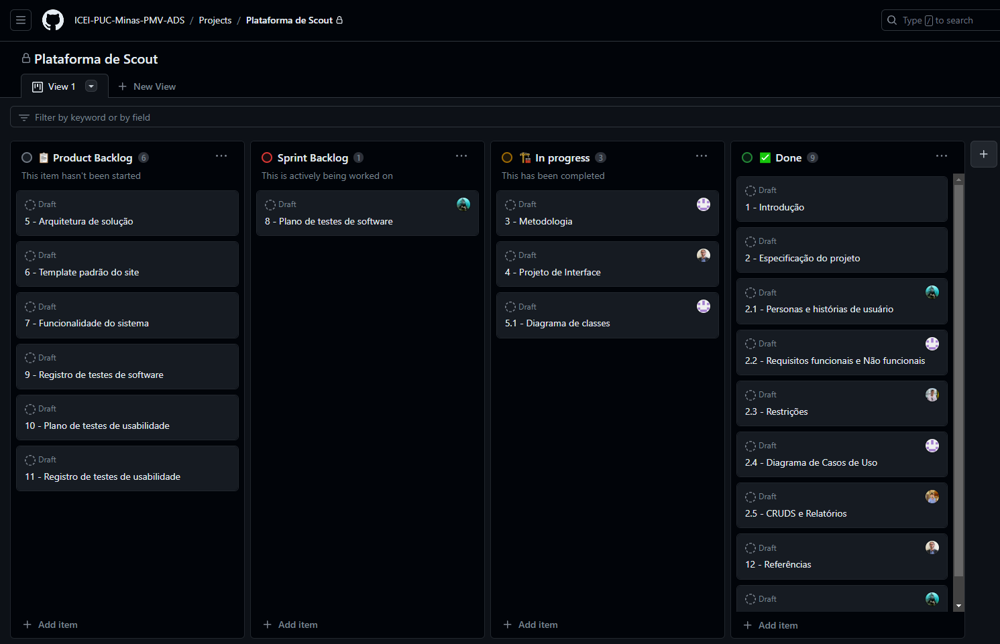

# Metodologia

Contextualizamos todo o processo relacionado ao desenvolvimento do sistema de Scout, ou seja, a metodologia utilizada para o organizar e gerenciar as atribuições do nosso time.

Apresentamos todas as ferramentas, os ambientes e as partes estruturais descritas do trabalho, bem como a aplicação da linguagem adotada por nossa equipe de desenvolvimento para a execução do projeto.

## Gerenciamento de Projeto

O Scrum é a metodologia ágil escolhida pela equipe, ela é a base fundamental para todo o processo de desenvolvimento.

### Equipe de Trabalho

A equipa está organizada da seguinte maneira:
- `Scrum Master`: Daniel Dutra De Aguiar
- `Product Owner`: Luiz Felipe Sena Costa
- `Equipe de Desenvolvimento`: Caê Moreira Euphrásio, Lucas Henrique Da Silva Vaz, Raul Janon, Vagner De Oliveira Florencio 
- `Equipe de Design`: Diogo Amâncio Da Silva
 
### Ferramentas

As ferramentas empregadas no projeto são:

| **Ambiente** | **Plataforma** | **Link de acesso** |
|:----|:---|:-----|
| Comunicação | Teams   Whatsapp | https://teams.microsoft.com/   https://www.whatsapp.com/ |
| Documentos do Projeto | Github   Sharepoint | https://github.com/   https://sgapucminasbr.sharepoint.com/ |
| Editor de código | Visual Studio Code | https://code.visualstudio.com |
| Gerenciamento do Projeto | Github | https://github.com/ |
| Projeto de Interface e Wireframe | Figma | https://www.figma.com/ |
| Respositório do Código Fonte | Github | https://github.com/ |
| Diagramas | draw.io | https://www.diagrams.net/ |

O Teams será usado para videoconferências das reuniões de planejamento do sprint, backlog do sprint, revisão do sprit e revisão do sprint. O Whatsapp para comunicações pontuais no decorrer do dia.

A documentação do projeto ficará hospedada no Github, em razão da facilidade de acesso por parte dos integrantes da equipe. Nos casos em que houver necessidade de documentos mais elaborados (apresentações, planilhas, etc), será utilizado o Office 365, com hospedagem no Sharepoint. Da mesma forma serão utilizadas as ferramentas de gerenciamento de projeto da plataforma, bem como a mesma também servirá de repositório para o código fonte, em razaão de suas funcionalidades de controle de versão.

Para edição de código, foi escolhida a ferramenta Visual Studio Code por: 1) ser gratuita e opensource; 2) ser amplamente  utilizada; 3) possuir um extenso marketplace de addins que possibilitam expandir suas funções, inclusive integrando com o sistema de controle de versões.

## Processos

Logo abaixo segue todas as informações sobre a implementação do Scrum e um detalhamento completo relacionado a cada sprint: o andamento do projeto, a execução de tarefas e o status de desenvolvimentro da solução.

Para a organização e distribuição das tarefas do projeto, o grupo esta utilizando o GitHub, seguindo os critérios de:

- `Product Backlog`: Recebe as tarefas a serem trabalhadas e presenta o Backlogdo produto. Todas as atividades identificadas no decorrer do projeto são incorporadas a esta lista.
- `To Do`: Esta lista representa o Sprint Backlog que está sendo trabalhado.
- `In progress`: Lista das tarefas iniciadas.
- `Done`: Nesta lista são colocadas as tarefas finalizadas e as que passaram pelos testes e controle de qualidade.

## Etapa 01

Daniel, Diogo e Luiz: Criação do grupo e da ideia inicial do Projeto.

Caê, Lucas e Vagner: Completaram o grupo e contribuíram para a criação do conceito do Projeto.

Toda a comunicação dos integrantes é realizada diariamente via o grupo do WhatsApp com a participação ativa dos membros.

-	**Planejamento**:

Nesta etapa está planejada a elaboração da Concepção e proposta de solução.

Seguindo também a composição dos referentes tópicos: Definição do problema, Proposta de solução, Personas e Histórias de usuários, 
Requisitos e Restrições, Diagrama de Casos de Uso, Vídeo de 2 minutos sobre o problema e a Documentação atualizada no Github.

-	**Execução**:

Diogo e a participação ativa de todos os membros opinando ou alterando algum conteúdo: 
Introdução, Problema, Proposta de Solução/Objetivos, Justificativa e Público-Alvo, Referências e Slide da Apresentação.

Vagner, Luiz, Diogo e a participação ativa de todos os membros opinando ou alterando algum conteúdo: 
Especificação do Projeto, Personas, Histórias de usuários. 

Caê  e a participação ativa de todos os membros opinando ou alterando algum conteúdo: 
Estuturação do projeto via Github, Board, Issues e Backlog do Projeto, Requisitos funcionais e não funcionais.

Daniel e a participação ativa de todos os membros opinando ou alterando algum conteúdo: 
Restrições.

Luiz, Daniel, Caê e a participação ativa de todos os membros opinando ou alterando algum conteúdo: 
CRUDS e Diagrama de casos de uso.

Vagner e a participação ativa de todos os membros opinando ou alterando algum conteúdo: 
Vídeo da apresentação.

O integrante Raul entrou no grupo no final da primeira etapa do projeto.

-	**Evidências**:

**Atualização do Board do GitHub (Kanban) com as atividades de toda a etapa 01 do trabalho no dia 11/09/2023:**

**Atualização do Board do GitHub (Kanban) com as atividades de toda a etapa 01 do trabalho no dia 03/09/2023:**

**Board Atualizado com os Issues e Milestones concluídos da Etapa 01 no dia 03/09/2023:**

**Vídeo Apresentação do Problema e a Solução para o Projeto Scout**:

https://github.com/ICEI-PUC-Minas-PMV-ADS/pmv-ads-2023-2-e2-proj-int-t1-time2-futebol/assets/126628545/6be6c847-99b4-4430-8e07-52bd24cfd486

## Etapa 02

-	**Planejamento**:

Nesta etapa está planejada a elaboração do Projeto da Solução.

Seguindo também a composição dos referentes tópicos: Documentação da Metodologia, Diagrama de Classes, Diagrama de Fluxo,
Wireframes interativos, Modelo Entidade Relacionamento (Projeto Conceitual), Projeto da Base de Dados, Plano de Testes de Software,
Plano de Testes de Usabilidade,  Projeto do Github com Backlog e Plano de Sprints.

-	**Execução**:

Caê, Diogo e a participação ativa de todos os membros opinando ou alterando algum conteúdo: 
Metodologia, Diagrama de Classe.

Diogo, Luiz, Daniel e a participação ativa de todos os membros opinando ou alterando algum conteúdo: 
Projeto de Interface, Diagrama de Fluxo.

Vagner e a participação ativa de todos os membros opinando ou alterando algum conteúdo: 
Plano de Teste de Usabilidade, envio da etapa via Canvas.

Raul e a participação ativa de todos os membros opinando ou alterando algum conteúdo:
Plano de Testes.

Luiz, Daniel e a participação ativa de todos os membros opinando ou alterando algum conteúdo:
Modelo de Entidade Relacional.

-	**Evidências**:

**Atualização do Board do GitHub (Kanban) com as atividades de toda a etapa 02 do trabalho no dia 24/09/2023:**

**Figura Board 01**:

**Figura Board 02**:

**Board Atualizado com os Issues e Milestones concluídos da Etapa 02 no dia 24/09/2023:**

## Etapa 03

-	**Planejamento**:
  
Nesta etapa está planejada o Desenvolvimento da solução - Fase 1.

Seguindo também a composição dos referentes tópicos: Template padrão da aplicação interativa, Prova de Conceito da Arquitetura (POC) - exemplo de implementação com a integração do front-end com o back-end, Programação de Funcionalidades, Realização e registro dos testes de software, Realização e registro dos testes de usabilidade, Projeto do Github com Backlog e Plano de Sprints.

-	**Execução**:

Caê e a participação ativa de todos os membros opinando ou alterando algum conteúdo:
Página de Login.

Luiz, Daniel, Diogo e Vagner e a participação ativa de todos os membros opinando ou alterando algum conteúdo:
Banco de Dados.

Diogo e a participação ativa de todos os membros opinando ou alterando algum conteúdo:
Atualização na parte de Metodologia, Backlog e no Plano de Sprints.

Luiz criou o CRUD de atacantes. Daniel, Diogo e Vagner estão finalizando a criação do CRUD de Clubes.

Caê e Luiz realizaram a integração do CRUD de Atacantes com a de Login.

Luiz e Câe realizaram o upload da aplicação do projeto para a nuvem.

Daniel e Luiz estão concluindo o CRUD de Clubes.

Diogo e Luiz realizaram todo o Registro de Software com o vídeo demonstrativo e as perguntas das análises expostas.

Diogo produziu todas as perguntas dos Planos de Testes de Usabilidade, Plano de Testes de Usabilidade e Registros de Testes de Usabilidade.

-	**Evidências**:

**Atualização do Board do GitHub (Kanban) com as atividades de toda a etapa 03 do trabalho no dia 05/10/2023:**

  

**Programação em andamento CRUD Clubes:**

  

  **Board Atualizado com os Issues e Milestones em andamento da Etapa 03 no dia 06/10/2023:**

  

  **Atualização do Board do GitHub (Kanban) com as atividades completas de toda a etapa 03 do trabalho no dia 22/10/2023:**

  

  **Board Atualizado com os Issues e Milestones em concluídos da Etapa 03 no dia 22/10/2023:**

  

 **Site já exportado para a Nuvem:**

  **Link**: https://futscoutpuc.azurewebsites.net/

**Tela Home Page**:

**Tela de listas de Atacantes**:

**Tela para cadastro de Atacantes**:

**Tela de Lista de Clubes**:

## Etapa 04

Nesta etapa está planejada o Desenvolvimento da solução - Fase 2.

-	**Planejamento**:

Seguindo também a composição dos referentes tópicos: Template padrão da aplicação interativa, Programação de Funcionalidades , Realização e registro dos testes de software, Realização e registro dos testes de usabilidade, Projeto do Github com Backlog e Plano de Sprints e Projeto do Github exportado como .zip com os entregáveis.

-	**Execução**:

O Vagner, Raul e Lucas ficaram responsáveis pelo cadastro dos Atacantes e Clubes em nossa plataforma.

Até o momento, o Lucas cadastrou 4 atacantes de 6 clubes.
Para cada time, está sendo anexado 4 atacantes totalizando 24 jogadores.

O Vagner cadastrou 5 clubes e 4 atacantes no projeto. O Raul também já iniciou os cadastros.

O Câe e o Luiz atuaram na elaboração dos seguintes requisitos: 

RF-09 -> A aplicação deve permitir opções para os usuários filtrarem os atacantes por divisão e clube para uma pesquisa mais focada.

RF-10 -> A aplicação deve fornecer um ranking de todos os atacantes cadastrados, classificando-os com base em suas tendências, do melhor ao pior. A aplicação deve permitir opções para os usuários filtrarem os atacantes por divisão e clube para uma pesquisa mais focada.

Agora, ambos estão atuando na melhoria do front-end.

Diogo está responsável pela Programação de Funcionalidades, Plano de Testes de Software, Registro de Testes de Software, Plano de Testes de Usabilidade e Registro de Testes de Usabilidade.

Caê e o Luiz estão em conjunto, buscando a solução da filtragem de atacantes, divisão e clubes. Já realizaram vários testes, inclusive, com o suporte da monitoria da PUC.

O Diogo, seguindo as orientações do último encontro com a orientadora, produziu o Modelo ER (Projeto Conceitual) e o Projeto da Base de Dados que estava pendente.

Luiz e Câe conseguiram resolver o problema da ordenação, dessa forma, agora a plataforma está 100% funcional e atualizada. O Commit das alterações do controller de clubes e atacantes dentro de views além do índex de clubes e atacantes seguiram as mesmas modificações e estão totalmente atualizadas no Github.

O Diogo encaminhou os entregáveis da etapa 4 do Projeto.

-	**Evidências**:

**Atualização do Board do GitHub (Kanban) com as atividades de toda a etapa 4 do trabalho no dia 26/10/2023:**

**Atualização do Board do GitHub (Kanban) com as atividades de toda a etapa 4 do trabalho no dia 09/11/2023:**

**Atualização do Board do GitHub (Kanban) com as atividades de toda a etapa 4 do trabalho no dia 17/11/2023:**

**Atualização do Board do GitHub (Kanban) com as atividades de toda a etapa 4 do trabalho no dia 19/11/2023:**

**Board Atualizado com os Issues e Milestones em concluídos da Etapa 04 no dia 19/11/2023:**

## Etapa 05

Relatórios das avaliações e entrega da solução.

-	**Planejamento**:

Seguindo também a composição dos referentes tópicos: Relatório do teste de software, Relatório do teste de usabilidade, Apresentação da solução, Projeto do Github com Backlog e Plano de Sprints, Vídeo de até 3 minutos e Projeto do Github exportado como .zip com os entregáveis.

-	**Execução**:

  Luiz, Caê, Diogo e Daniel Dutra estão aguardando o feedback da orientadora sobre a etapa 04 para realizar as próximas tarefas da Etapa 05.

  O Diogo já atualizou o Board com os Issues e os Millestones da Etapa 05, ele também já começou a produzir os slides para a apresentação final.
  
- **Evidências**:

**Atualização do Board do GitHub (Kanban) com as atividades de toda a etapa 5 do trabalho no dia 23/11/2023:**

**Atualização do Board do GitHub (Kanban) com as atividades de toda a etapa 4 do trabalho no dia 06/12/2023:**

****Board Atualizado com os Issues e Milestones em concluídos da Etapa 05 no dia 06/12/2023:**

**Projeto FutScout Concluído:**

## Controle de Versão 

A ferramenta de controle de versão adotada no projeto foi o [Git](https://git-scm.com/), sendo que o [Github](https://github.com) foi utilizado para hospedagem do repositório.
